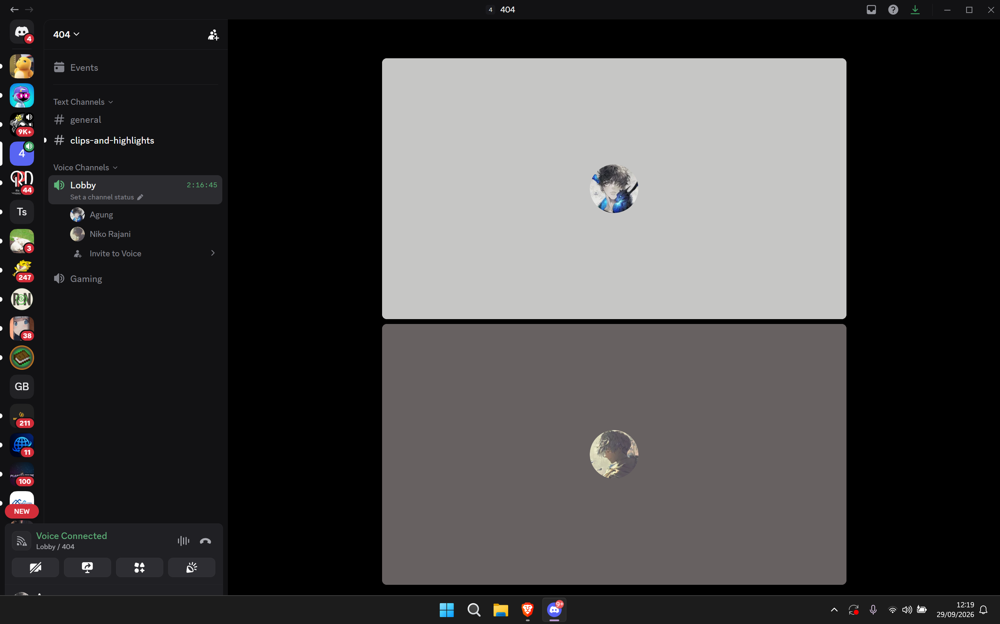
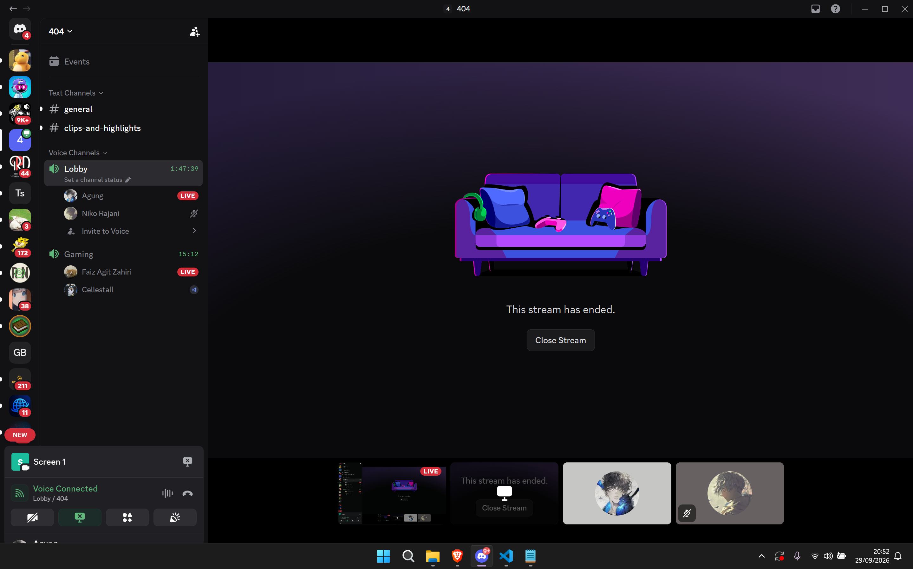

# Jurnal Proses — Tugas 2

## 26 September 2026
- Opsi arsitektur yang dipertimbangkan: Menggunakan arsitektur SOA untuk semua Sistem FoodGo
- Kenapa akhirnya pilih SOA: Karena di nilai aman karena menggunakan mekanisme Request - Response. 
- Revisi diagram (versi 1 → versi 2, apa yang berubah dan kenapa): Diagram awal yang sederhana, hanya punya 4 modul dengan alur yang simpel. 

## 27 September 2026
- Opsi arsitektur yang dipertimbangkan: Menggunakan arsitektur SOA untuk semua Sistem FoodGo
- Kenapa akhirnya pilih SOA: Karena di nilai aman karena menggunakan mekanisme Request - Response. 
- Revisi diagram (versi 1 → versi 2, apa yang berubah dan kenapa): Menambahkan Beberapa Detail dan service seperti penambahan Service Kurir dan Notifikasi, dan juga alur pemotongan saldo. 

## 29 September 2026
- Opsi arsitektur yang dipertimbangkan: Merubah agar menggunakan hibrid, SOA dan Publish Subscribe. 
- Kenapa akhirnya pilih SOA & Pub-Sub:  Karena SOA dinilai aman, tetapi sangat lambat karena memerlukan pesan dua arah berupa request dan response. jadi untuk proses yang memerlukan kecepatan seperti Service dapur untuk memproses pesanan, di perlukan sistem Pub-Sub yang cepat. 
- Revisi diagram (versi 1 → versi 2, apa yang berubah dan kenapa): Merubah keseluruhan diagram nya untuk menerapkan hibrida (SOA untuk Service Pesanan, Katalog, Pembayaran yang membutuhkan keandalan dan keamanan dan Pub-Sub untuk Service Dapur dan Service Kurir yang membutuhkan kecepatan)
Bukti:

link refrensi: 
- https://binus.ac.id/bekasi/2025/07/service-oriented-architecture/
- https://aws.amazon.com/id/what-is/service-oriented-architecture/
- https://medium.com/@reza_devhub/apa-itu-pub-sub-6ab0591329c9
- https://docs.digitalamoeba.id/technology/publish-subscribe-pola-desain-komunikasi-back-end-penting-beserta-implementasinya/
  
## Log Penggunaan AI (Level 2)

> Wajib diisi sesuai kebijakan Level 2 di [`../RUBRIK-UMUM.md`](../RUBRIK-UMUM.md). Tulis "Tidak memakai AI" pada baris pertama jika memang tidak dipakai. Hanya untuk brainstorming ide/outline — bukan untuk kode/analisis/teks akhir.

| Tanggal | Tool AI | Prompt yang diberikan | Ringkasan saran/ide AI | Bagaimana diolah jadi tulisan/kode sendiri |
|26 September 2026| Claude |"Saya sedang mempelajari gaya arsitektur perangkat lunak, dan menemukan 2 arsitektur SOA dan Publish Subscriber, Berikan penjelasan detail mengenai kedua arsitektur tersebut, beserta analogi dan contoh. Serta berikan 1 studi kasus dimana arsitektur itu di butuhkan oleh Suatu perangkat Lunak"|Informasi Mengenai arsitektur Sub-Pub dan SOA|Menjadi Informasi untuk memilih jenis arsitektur yang digunakan nantinya.|
| 28 September 2026| Claude | "Bantu Saya untuk mengubah gambar arsitektur ini kedalam suatu diagram mermaid yang bisa di tampilkan di github" | Mengubah gambar yang kasar menjadi diagram di AI. | - |
| 29 September 2026| Gemini | "berikan saya referensi tentang masalah coupling dan juga trade-0ff dari permasalahan Network is Reliabel,Latency is zero,Single Point of Failure tentang gofood" | Contoh Studi kasus mengenai masalah coupling dari permasalahan tersebut. | memanfaatkan informasi itu untuk menjawab soal nomor 4. |
