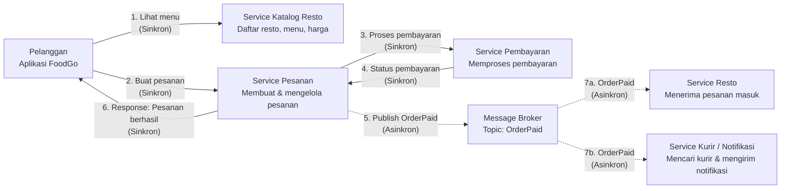
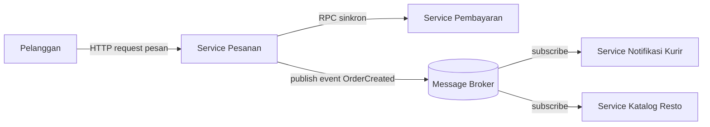

# Tugas 2 (Pekan 2) — Perancangan Arsitektur untuk FoodGo

**Materi terkait:** Architectural style (Layered, SOA, Peer-to-Peer, Publish-Subscribe).

## Studi Kasus

Melanjutkan Tugas 1: FoodGo butuh sistem yang **decoupled** agar tim kurir dan tim resto tidak saling mengganggu ketika salah satu modul diperbarui/deploy ulang. Saat ini semua modul (pesanan, pembayaran, notifikasi kurir, katalog resto) berjalan sebagai satu aplikasi monolitik — sekali deploy, semua modul ikut restart dan berisiko downtime total.

## Tugas Kelompok

1. Pilih **satu** gaya arsitektur utama: **Service-Oriented Architecture (SOA)** atau **Publish-Subscribe**. Boleh dikombinasikan (mis. SOA untuk service inti + Pub-Sub untuk notifikasi), tapi harus dijustifikasi kenapa kombinasi ini yang dipilih.
2. Gambarkan minimal 4 komponen berikut dan interaksinya: modul Pesanan, modul Pembayaran, modul Kurir/Notifikasi, modul Katalog Resto (dan message broker/API gateway jika relevan).
3. Jelaskan alur satu skenario penuh secara end-to-end di diagram (misalnya: pelanggan buat pesanan → bayar → resto terima notifikasi → kurir ditugaskan) — tunjukkan komponen mana berkomunikasi dengan siapa, dan **jenis komunikasinya** (sinkron/asinkron, request-response/event).
4. Analisis tertulis: kenapa gaya ini mengatasi masalah *coupling* dari Tugas 1, dan apa trade-off-nya (mis. Pub-Sub menambah kompleksitas debugging karena alur tidak linear).


## Jawaban untuk soal yang berada di README.md
1.kami memilih kombinasi karena sistem FoodGo memiliki 2 karakteristik untuk  kebutuhan berbeda. Transaksi finansial (Pesanan dan Pembayaran) membutuhkan konsistensi data dan kepastian respons secara langsung (real time), tetapi di di sisi lain proses pasca-pembayaran dapat berjalan di latar belakang tanpa mengharuskan pelanggan menunggu komputasinya selesai.

SOA(singkron):  Di gunakan pada Service pesanan dan Service Pembayaran. Pelanggan membutuhkan kepastian instan (real-time) apakah pembayaran mereka berhasil atau ditolak. Komunikasi ini harus sinkron.Publish-Subscribe 

Publish-Subscribe (Asinkron): Digunakan untuk mendelegasikan tugas ke Service Resto dan Service Kurir. Setelah pembayaran berhasil, aplikasi pesanan tidak perlu menunggu kurir ditemukan untuk membalas ke pengguna. Pesanan cukup "mengumumkan" (publish event) bahwa ada pesanan masuk, lalu modul lain akan bereaksi secara mandiri.

2. ## Diagram Arsitektur FoodGo




3. Penjelasan Alur Skenario End-to-End
Skenario : Pelanggan membuat pesanan makanan hingga pesanan diterima oleh pihak Resto dan Kurir ditugaskan.
a. Pembuatan Pesanan (Sinkron): Pelanggan menekan tombol "Pesan" di aplikasi, maka aplikasi mengirim HTTP Request ke Service Pesanan.
b. Validasi Pembayaran (Sinkron): Service Pesanan melakukan pemanggilan request-response ke Service Pembayaran untuk memvalidasi saldo pelanggan. Service Pesanan akan "Menunggu" dengan timeout hingga Service Pembayaran membalas sukses.
c. Penerbitan Event (Asinkron): Setelah pembayaran terkonfirmasi, Service Pesanan mengirim pesan berbentuk event pertama OrderPaid kedalam message Broker. Pada detik ini juga, Service Pesanan langsung membalas ke HP pelanggan: "Pesanan berhasil, sedang diproses!" tanpa perlu menunggu respon kurir.
d. Berlangganan & Reaksi (Asinkron): Service Resto dan Service Kurir yang sejak awal sudah "berlangganan" (Subscribe) ke topik OrderPaid di Message Broker akan otomatis menerima pesan tersebut secara paralel.
e. Tindak lanjut independen:
- Service Resto memperbarui basis data dan meneruskan notifikasi pesanan masuk ke tablet/aplikasi yang ada di dapur resto.
-Service Kurir memulai algoritma pencarian lokasi (geospacial) untuk menemukan kurir terdekat, lalu mengirim push notification ke aplikasi kurir.

4. Analilis masalah Coupling & Trade-off
Mengapa desain ini mengatasi masalah coupling dari tugas 1:
Pada desain monolitik pada tugas 1, jika modul kurir macet atau sedang di deploy ulang, modul pesanan ikut error karena mereka saling menunggu (tighly coupled). Dengan gaya Publish-Subscribe, sistem menjadi terdekopel (decoupled). Jika Service Kurir kebetulan sedang down, pelanggan tetap bisa melakukan pesanan dan bayar dengan lancar. Event OrderPaid tidak akan hilang, melainkan aman mengantre di dalam Message Broker. Begitu Service Kurir menyala kembali ia akan langsung mengambil antrean event tersebut dan memprosesnya (Fault Tolerance / Loose Coupling).

Trade-off

1. Kompleksitas Debugging & Tracing: Karena alurnya menggunakan Pub_Sub (tidak linear dan berjalan di latar belakang), saat pelanggan komplain "Resto belum terima pesanan saya", developer kesulitan melacak error-nya. Berbeda dengan monolitik, developer kini harus mengecek log di Service Pesanan, lalu mengecek Message Broker, lalu mengecek log di Service Resto. Butuh sistem Centralized Logging tambahan untuk mengatasinya.

2. Kompleksitas Infrastruktur (Biaya): Menjalankannya dan merawat komponen tambahan seperti Message Broker membutuhkan biaya ekstra untuk server, serta keahlian khusus bagi tim IT (DevOps) dibandingkan sekedar merawat satu server monolitik besar.

3. Eventual Consistency: Data antar layanan tidak update secara serempak di detik yang sama, melainkan tertunda sekian milidetik/detik (sistem konsisten secara perlahan), yang mana butuh penanganan error khusus jika proses asinkron gagal di tengah jalan.


## Cara Membuat Diagram (Gratis, Cukup Laptop)

Tidak perlu software berbayar. Dua opsi:

**Opsi A — Mermaid di dalam Markdown (disarankan).** Ditulis sebagai teks biasa di `README.md`, otomatis dirender jadi diagram oleh GitHub — tidak perlu install apa pun.

````markdown

````

**Opsi B — draw.io / diagrams.net** (gratis, jalan di browser tanpa akun, atau app desktop offline di [app.diagrams.net](https://app.diagrams.net/)). Ekspor sebagai `.png` dan simpan di folder `diagram/`.

## Struktur Submission

```
tugas-02-perancangan-arsitektur/
├── README.md          # Analisis + diagram Mermaid (jika Opsi A) atau referensi ke diagram/
├── JURNAL.md
└── diagram/            # File .png/.drawio jika pakai Opsi B
```

## Rubrik Penilaian (Tugas 2)

| Komponen | Bobot | Kriteria |
|---|---|---|
| Ketepatan pemilihan gaya arsitektur | 20% | Justifikasi SOA/Pub-Sub sesuai kebutuhan *decoupling* di skenario |
| Kelengkapan & kejelasan diagram | 30% | Semua komponen kunci ada, jenis komunikasi (sinkron/asinkron) jelas ditandai |
| Analisis trade-off | 30% | Bukan hanya kelebihan — kekurangan/kompleksitas baru juga dibahas |
| Proses & kontribusi kelompok | 20% | `JURNAL.md`, commit history |

## Batasan Penggunaan AI (Level 2)

Kebijakan **Level 2 (AI Assisted Idea Generation & Structuring)** berlaku — lihat [`../RUBRIK-UMUM.md`](../RUBRIK-UMUM.md). Boleh memakai AI untuk brainstorming komponen apa saja yang umum ada di gaya arsitektur SOA/Pub-Sub; **tidak boleh** meminta AI menggambar diagram final atau menuliskan analisis trade-off yang tinggal ditempel. Catat pemakaian AI di "Log Penggunaan AI" pada `JURNAL.md`.

- Diagram Mermaid/draw.io yang "terlalu generik" (identik dengan contoh tutorial di internet tanpa penyesuaian ke kasus FoodGo) akan dinilai rendah pada komponen kelengkapan & kejelasan diagram.
