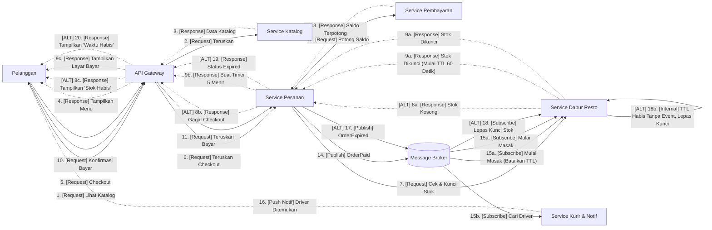

# Tugas 2 (Pekan 2) — Perancangan Arsitektur untuk FoodGo

**Materi terkait:** Architectural style (Layered, SOA, Peer-to-Peer, Publish-Subscribe).

## Studi Kasus

Melanjutkan Tugas 1: FoodGo butuh sistem yang **decoupled** agar tim kurir dan tim resto tidak saling mengganggu ketika salah satu modul diperbarui/deploy ulang. Saat ini semua modul (pesanan, pembayaran, notifikasi kurir, katalog resto) berjalan sebagai satu aplikasi monolitik — sekali deploy, semua modul ikut restart dan berisiko downtime total.

## Tugas Kelompok

1. Pilih **satu** gaya arsitektur utama: **Service-Oriented Architecture (SOA)** atau **Publish-Subscribe**. Boleh dikombinasikan (mis. SOA untuk service inti + Pub-Sub untuk notifikasi), tapi harus dijustifikasi kenapa kombinasi ini yang dipilih.
2. Gambarkan minimal 4 komponen berikut dan interaksinya: modul Pesanan, modul Pembayaran, modul Kurir/Notifikasi, modul Katalog Resto (dan message broker/API gateway jika relevan).
3. Jelaskan alur satu skenario penuh secara end-to-end di diagram (misalnya: pelanggan buat pesanan → bayar → resto terima notifikasi → kurir ditugaskan) — tunjukkan komponen mana berkomunikasi dengan siapa, dan **jenis komunikasinya** (sinkron/asinkron, request-response/event).
4. Analisis tertulis: kenapa gaya ini mengatasi masalah *coupling* dari Tugas 1, dan apa trade-off-nya (mis. Pub-Sub menambah kompleksitas debugging karena alur tidak linear).

## Cara Membuat Diagram (Gratis, Cukup Laptop)

Tidak perlu software berbayar. Dua opsi:

**Opsi A — Mermaid di dalam Markdown (disarankan).** Ditulis sebagai teks biasa di `README.md`, otomatis dirender jadi diagram oleh GitHub — tidak perlu install apa pun.


**Opsi B — draw.io / diagrams.net** (gratis, jalan di browser tanpa akun, atau app desktop offline di [app.diagrams.net](https://app.diagrams.net/)). Ekspor sebagai `.png` dan simpan di folder `diagram/`.

## Struktur Submission

```
tugas-02-perancangan-arsitektur/
├── README.md          # Analisis + diagram Mermaid (jika Opsi A) atau referensi ke diagram/
├── JURNAL.md
└── diagram/            # File .png/.drawio jika pakai Opsi B
```

## Rubrik Penilaian (Tugas 2)

| Komponen | Bobot | Kriteria |
|---|---|---|
| Ketepatan pemilihan gaya arsitektur | 20% | Justifikasi SOA/Pub-Sub sesuai kebutuhan *decoupling* di skenario |
| Kelengkapan & kejelasan diagram | 30% | Semua komponen kunci ada, jenis komunikasi (sinkron/asinkron) jelas ditandai |
| Analisis trade-off | 30% | Bukan hanya kelebihan — kekurangan/kompleksitas baru juga dibahas |
| Proses & kontribusi kelompok | 20% | `JURNAL.md`, commit history |

## Batasan Penggunaan AI (Level 2)

Kebijakan **Level 2 (AI Assisted Idea Generation & Structuring)** berlaku — lihat [`../RUBRIK-UMUM.md`](../RUBRIK-UMUM.md). Boleh memakai AI untuk brainstorming komponen apa saja yang umum ada di gaya arsitektur SOA/Pub-Sub; **tidak boleh** meminta AI menggambar diagram final atau menuliskan analisis trade-off yang tinggal ditempel. Catat pemakaian AI di "Log Penggunaan AI" pada `JURNAL.md`.

- Diagram Mermaid/draw.io yang "terlalu generik" (identik dengan contoh tutorial di internet tanpa penyesuaian ke kasus FoodGo) akan dinilai rendah pada komponen kelengkapan & kejelasan diagram.


## Analisis Jawaban

1. Kami memilih mengkombinasikan dua arsitektur **Service-Oriented Architecture (SOA)** dan **Publish-Subscribe**. Kita menerapkan SOA (komunikasi sinkron) pada interaksi yang berhadapan langsung dengan pelanggan yang butuh data aktual. Saat aplikasi memuat daftar menu dari Service Katalog atau memproses transaksi di Service Pembayaran, alurnya berjalan sebagai request-response langsung. Pelanggan mendapatkan validasi dan kepastian di detik yang sama bahwa uang mereka diterima dan pesanan tercatat. Setelah pembayaran dikonfirmasi, sistem  menggunakan Pub-Sub (komunikasi asinkron) untuk mengurus operasional lanjutan. Service Pesanan tidak perlu lagi repot-repot menghubungi restoran atau mencari pengemudi; ia hanya menyiarkan satu event "Pesanan Lunas" ke dalam Message Broker dan tugas utamanya pun selesai. Service Dapur dan Service Kurir bertindak sebagai subscriber independen yang mengambil event tersebut dan mengeksekusinya secara paralel. Karena mereka dipisahkan oleh broker, jika tim kurir memutuskan untuk me-restart server mereka, tim resto tidak akan merasakan dampaknya dan tetap bisa menerima pesanan seperti biasa.

2. **Diagram**:

<br>

3. ****Skenario pemesanan makanan pada sistem FoodGo dengan menggunakan pendekatan hibrida (SOA dan Publish-Subscribe):****
    <br>

    1. **Melihat Menu Makanan (1 – 4)**
    Pelanggan membuka fitur katalog untuk memilih makanan. Aplikasi mengirim permintaan melalui API Gateway lalu diteruskan langsung ke Service Katalog secara sinkron.Service Katalog langsung membalas dengan mengirimkan data menu terbaru ke API Gateway hingga muncul di halaman pelanggan.
    
    2. **Checkout & Pengecekan Stok (5 – 7)**
    Ketika pelanggan menekan tombol checkout, permintaan dikirim melalui API Gateway menuju ke Service Pesanan.Sebelum meminta pelanggan membayar, Service Pesanan menghubungi Service Dapur Resto secara langsung (sinkron) untuk mengecek apakah ada tersedianya menu dan menguncinya sementara agar tidak diambil pembeli lain.
    
    3. **Jika stock habis (8a - 8c)**
    Apabila Service Dapur Resto mengecek stok menu tersebut habis, Dapur langsung mengirimkan data dengan pesan "Stok Kosong" ke Service Pesanan. Service Pesanan kemudian melanjutkan pesan gagal ke API Gateway, sehingga di halaman checkout pelanggan menampilkan pemberitahuan bahwa stok habis. 
    
    4. **Alur Siap Bayar dan Timer Pembayaran (9a - 9c)**
    Jika stok menu makanan tersedia, Service Dapur Resto akan mengunci stok tersebut dan mengaktifkan *Timer TTL* (*Time-To-Live*) mandiri (contohnya 5,5 menit) sebagai pelapis pengaman internal. Di saat yang sama, Service Pesanan membuat status pesanan baru (`PENDING_PAYMENT`) dan membuat timer pembayaran pelanggan (5 menit) ke API Gateway untuk ditampilkan di halaman pembayaran.
    
    5. **Pembayaran Berhasil (10 - 16)**
    jika pelanggan mengonfirmasi pembayaran sebelum waktu *timeout* habis, Service Pesanan langsung memanggil Service Pembayaran secara sinkron untuk memotong saldo. Setelah saldo berhasil dipotong, Service Pesanan menaruh pesan `OrderPaid` ke dalam Message Broker secara asinkron.Service Dapur Resto dan Service Kurir mengambil pesan tersebut dari Broker secara bersamaan. Saat menerima pesan tersebut, Service Dapur Resto mematikan timer TTL-nya dan mulai memasak makanan, sedangkan Kurir mulai mencari pengemudi terdekat lalu mengabari pelanggan lewat notifikasi.
    
    6. **Jika Waktu Bayar Habis  (17 - 20)**
    Jika pelanggan tidak melakukan pembayaran sampai batas waktu *timeout* habis, Service Pesanan mengirim pesan `OrderExpired` ke dalam Message Broker secara asinkron agar Service Dapur Resto membaca pesan tersebut dan melepas kuncian stok. Namun, jika terjadi gangguan jaringan atau Service Pesanan mengalami *crash* sehingga gagal mengirimkan pesan pembatalan, timer _TTL_ mandiri di Service Dapur Resto akan otomatis habis dan melepas kuncian stok secara mandiri tanpa bergantung pada Service Pesanan. Di waktu yang sama, aplikasi menampilkan pemberitahuan ke pelanggan bahwa waktu pembayaran telah habis, tanpa ada saldo yang terpotong sedikit pun.
    <br>


4. ****Analisis Solusi Coupling dan Trade-Off Arsitektur****
    1. **mengatasi masalah Coupling** 
        1. **Eliminasi Single Point of Failure (SPOF):**
         Pada arsitektur _monolitik_, seluruh modul berjalan dalam satu unit deployment.Jika modul kurir mengalami crash atau pembaruan (deploy ulang), seluruh aplikasi FoodGo ikut down. Dengan memisahkan setiap modul ke service independen, kegagalan pada Service Kurir & Notif tidak akan melumpuhkan Service Dapur Resto atau Service Pesanan.

        2. **Pemisahan Alur Operasional (Loose Coupling via Message Broker):**
        Pada sistem lama, modul pesanan harus memanggil modul dapur dan kurir satu per satu secara langsung. Dalam arsitektur baru, Service Pesanan cukup menyiarkan event (OrderPaid atau OrderExpired) ke Message Broker secara _fire-and-forget_. Service Dapur Resto dan Service Kurir mengambil pesan tersebut secara independen di latar belakang tanpa saling menunggu satu sama lain.

        3. **Pencegahan Transaksi Gagal di Awal:**
        Penerapan SOA (sinkron) saat checkout untuk mengecek dan mengunci stok di Dapur sebelum saldo dipotong, mencegah terjadinya pemotongan uang untuk barang yang sudah habis. Hal ini menghilangkan ketergantungan antar-layanan yang berisiko memicu proses pengembalian dana (refund) yang rumit.

    2. **Trade-Off**
        1. **Manajemen Penguncian Stok & Timer TTL Dual-Layer:**
        Karena stok dikunci sebelum pembayaran, sistem berisiko mengalami _stuck/leaked_ pemesanan jika pelanggan tidak jadi membayar. Untuk mengatasinya, diterapkan logika ganda: Service Pesanan mengirim event `OrderExpired` jika timeout (5 menit), dan Service Dapur Resto memasang _Timer_ _TTL_ (_Time-To-Live_) mandiri (contohnya 1 menit) sebagai pelapis pengaman (_fallback_). Kompleksitasnya terletak pada penanganan _race condition_ contohnya jika pembayaran berhasil di detik terakhir bersamaan dengan stok yang terlepas oleh TTL.

        2. **Kesulitan Debugging dan Observability:**
        Alur komunikasi berbasis _Publish-Subscribe_ bersifat asinkron dan tidak linier. Jika notifikasi kurir gagal terkirim atau pesan tersendat di broker, pengembang tidak bisa lagi melacak _log_ di satu tempat. Sistem membutuhkan infrastruktur _Distributed Tracing_ tambahan (seperti Jaeger/Zipkin) untuk melacak alur perjalanan pesan dari ujung ke ujung.

        3. **Ketergantungan pada Message Broker & Kebutuhan Idempotency:**
        Menambahkan Message Broker (seperti RabbitMQ atau Kafka) menambah satu komponen infrastruktur kritis baru yang wajib selalu aktif (_high availability_). Selain itu, karena koneksi jaringan asinkron berisiko mengirimkan pesan ganda (_duplicate message_), Service Dapur Resto wajib dibuat idempotent (memiliki mekanisme cek `order_id`) agar tidak memasak makanan yang sama dua kali.

        4. **Konsistensi Data Bertahap (Eventual Consistency):**
        Data di seluruh layanan tidak terbarui secara instan dalam satu transaksi database tunggal, melainkan secara bertahap. Terdapat jeda beberapa milidetik hingga detik dari saat Service Pesanan menyatakan `OrderPaid` sampai Service Kurir menerima pesan tersebut dan mengalokasikan pengemudi.
    

