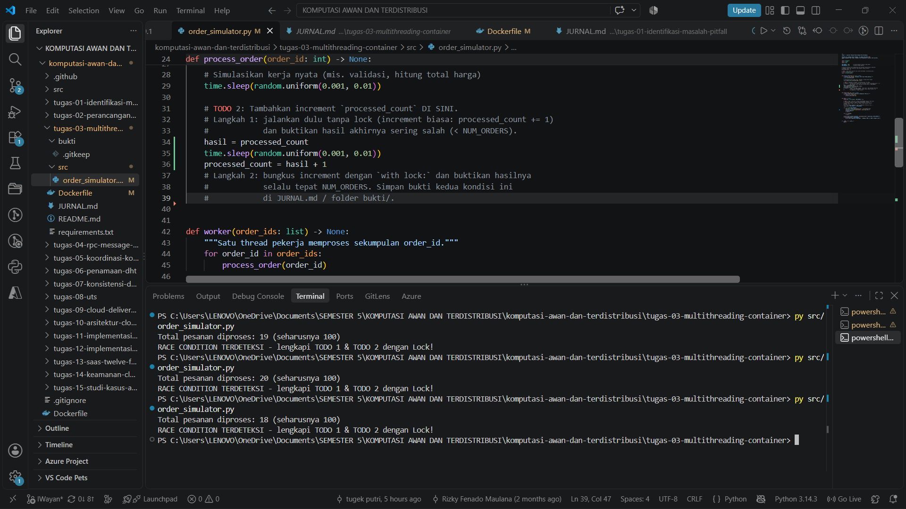
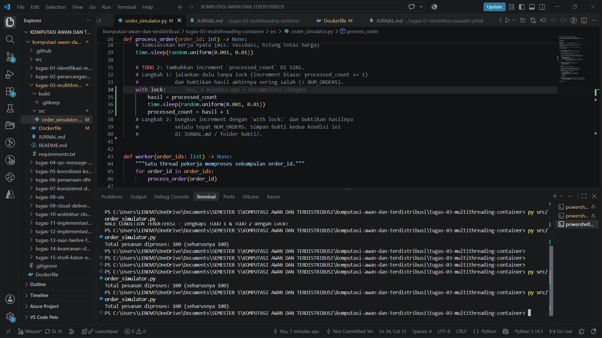

# Jurnal Proses — Tugas 3

## Percobaan tanpa Lock
- Hasil `processed_count` yang didapat: dari 3 percoban run mendapatkan hasil yang berbeda 19,20,18 yang dimana seharunya itu 100

- Kenapa bisa meleset (jelaskan mekanisme race condition dengan kata sendiri): karena dalam jangka waktu yang berdekatan proses pesanan yang sudah selesai akan menumpuk dan otomatis bakal berebut satu sama lain yang mengakibatkan terjadinya kesalahan input, misal pesanan pertama suda menyelesaikan pekerjaannya, namum pesanan kedua sudah menyelesaikannya juga dalam jangka waktu yang hampir sama jadi otomatis mereka beranggap jika pesanan yang sudah selesai baru 1 aja, padahal seharusnya sudah 2 yang selesai

## Percobaan dengan Lock
- Hasil `processed_count` setelah perbaikan: hasilnya konsisten di 100

- Kalau yang sebelumnya (tanpa Lock) proses/threadnya itu saling berebut dan bikin data "processed_count" jadi hancur, Lock disini bisa dibilang kayak "satpam" atau "sistem antrean".

## Kendala Docker
- Error yang ditemui saat `docker build`/`docker run` dan cara memperbaikinya: ...

## Log Penggunaan AI (Level 2)

> Wajib diisi sesuai kebijakan Level 2 di [`../RUBRIK-UMUM.md`](../RUBRIK-UMUM.md). Tulis "Tidak memakai AI" pada baris pertama jika memang tidak dipakai. Hanya untuk brainstorming ide/outline — bukan untuk kode/analisis/teks akhir.

| Tanggal | Tool AI | Prompt yang diberikan | Ringkasan saran/ide AI | Bagaimana diolah jadi tulisan/kode sendiri |
| :--- | :--- | :--- | :--- | :--- |
| 3-10-2026 | GPT | tolong jelaskan opsi sinkronisasi di Python | dijelaskan fungsi, mindmmapnya, anologi, dan perbedaan dari 8 sinkronisasi  | saya gunakkan untuk membuka pikiran saya dan membantu memahami maksud yang diberikan pada soal |
| 3-10-2026 | GPT | Gimana konsep (thread vs proses, race condition, Lock, join, dll.) | dijelaskan konsepnya seperti apa dari semua itu | untuk mengetahui lebih lanjut sebelum membuat kodenya di file order simulator |
| 3-10-2026 | GPT | bantu saya memahami baris Dockerfile secara umum (apa fungsi FROM, COPY, CMD) | dijelaskan masing" fungsinya dan cara dapat versi python | dari sana saya tau versi yang paing ringan yang saya gunnakkan di docker dan mengetahui fungsi" yang lain |
| 5-10-2026 | GEMINI | "docker : The term 'docker' is not recognized as the name of a cmdlet, function, script file, or operable program. Check the spelling of 

the name, or if a path was included, verify that the path is correct and try again.

At line:1 char:1

+ docker build -t foodgo-order-sim .

+ ~~~~~~

    + CategoryInfo          : ObjectNotFound: (docker:String) [], CommandNotFoundException

    + FullyQualifiedErrorId : CommandNotFoundException

" saya mengalami error saat mencoba menjalankan docker, bagaimana solusi yang benar? mohon berikan step by step solusinya | Error ini terjadi karena PowerShell tidak menemukan perintah docker. Hal ini biasanya disebabkan oleh 3 kemungkinan utama: Docker Desktop belum diinstal, Docker Desktop belum berjalan, atau Path variabel lingkungan (Environment Variables) belum terdaftar. | - |
