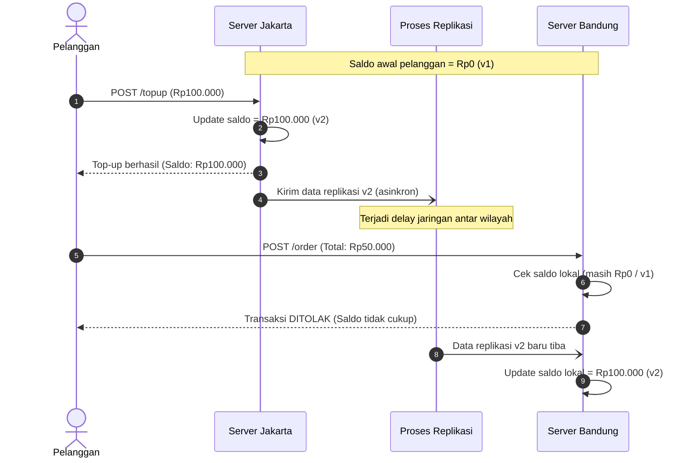
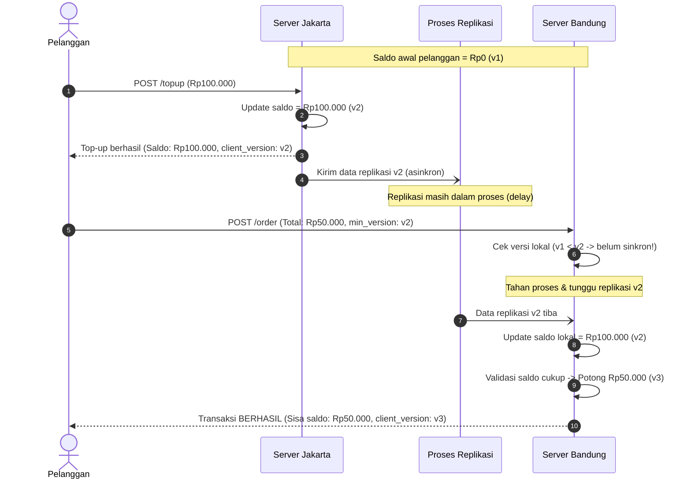

# diagram saat bug terjadi 

```mermaid
sequenceDiagram
    autonumber
    actor Pelanggan
    participant Jakarta as Server Jakarta
    participant Replikasi as Proses Replikasi
    participant Bandung as Server Bandung

    Note over Jakarta,Bandung: Saldo awal pelanggan = Rp0 (v1)

    Pelanggan->>Jakarta: POST /topup (Rp100.000)
    Jakarta->>Jakarta: Update saldo = Rp100.000 (v2)
    Jakarta-->>Pelanggan: Top-up berhasil (Saldo: Rp100.000)

    Jakarta-)Replikasi: Kirim data replikasi v2 (asinkron)
    Note over Replikasi: Terjadi delay jaringan antar wilayah

    Pelanggan->>Bandung: POST /order (Total: Rp50.000)
    Bandung->>Bandung: Cek saldo lokal (masih Rp0 / v1)
    Bandung-->>Pelanggan: Transaksi DITOLAK (Saldo tidak cukup)

    Replikasi-)Bandung: Data replikasi v2 baru tiba
    Bandung->>Bandung: Update saldo lokal = Rp100.000 (v2)
```

# diagram saat bug teratasi

```mermaid
sequenceDiagram
    autonumber
    actor Pelanggan
    participant Jakarta as Server Jakarta
    participant Replikasi as Proses Replikasi
    participant Bandung as Server Bandung

    Note over Jakarta,Bandung: Saldo awal pelanggan = Rp0 (v1)

    Pelanggan->>Jakarta: POST /topup (Rp100.000)
    Jakarta->>Jakarta: Update saldo = Rp100.000 (v2)
    Jakarta-->>Pelanggan: Top-up berhasil (Saldo: Rp100.000, client_version: v2)

    Jakarta-)Replikasi: Kirim data replikasi v2 (asinkron)
    Note over Replikasi: Replikasi masih dalam proses (delay)

    Pelanggan->>Bandung: POST /order (Total: Rp50.000, min_version: v2)
    Bandung->>Bandung: Cek versi lokal (v1 < v2 -> belum sinkron!)
    Note over Bandung: Tahan proses & tunggu replikasi v2

    Replikasi-)Bandung: Data replikasi v2 tiba
    Bandung->>Bandung: Update saldo lokal = Rp100.000 (v2)
    Bandung->>Bandung: Validasi saldo cukup -> Potong Rp50.000 (v3)
    Bandung-->>Pelanggan: Transaksi BERHASIL (Sisa saldo: Rp50.000, client_version: v3)
```
